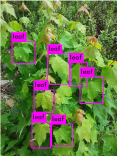

# Maple Leaf Detector 
Custom object detection using implemenetation of Yolov3 ([paper](https://pjreddie.com/media/files/papers/YOLOv3.pdf)) trained on 800 images of *Acer rubrum* for 3500 batches, starting with the pre-trained `yolov3.weights`. Training set images downloaded from [iNaturalist](https://www.inaturalist.org/taxa/48098-Acer-rubrum) and labeled with [LabelImg](https://github.com/tzutalin/labelImg). 



## Installation 
```
$ git clone https://github.com/etowahs/darknet.git
$ cd darknet
```

## Detecting Leaves 
To run the detector on a single image:

```
$ cd darknet 
$ ./darknet detector test custom/darknet.data custom/yolov3.cfg leaf.weights -ext_output my-image.jpg
```
To run the detector on an entire folder of images, create a .txt file containing the file locations of all the images. Ex. my-imgs.txt
```
$ ./darknet detector test custom/darknet.data custom/yolov3.cfg yolov3.backup -ext_output < my-imgs.txt > output.txt
```